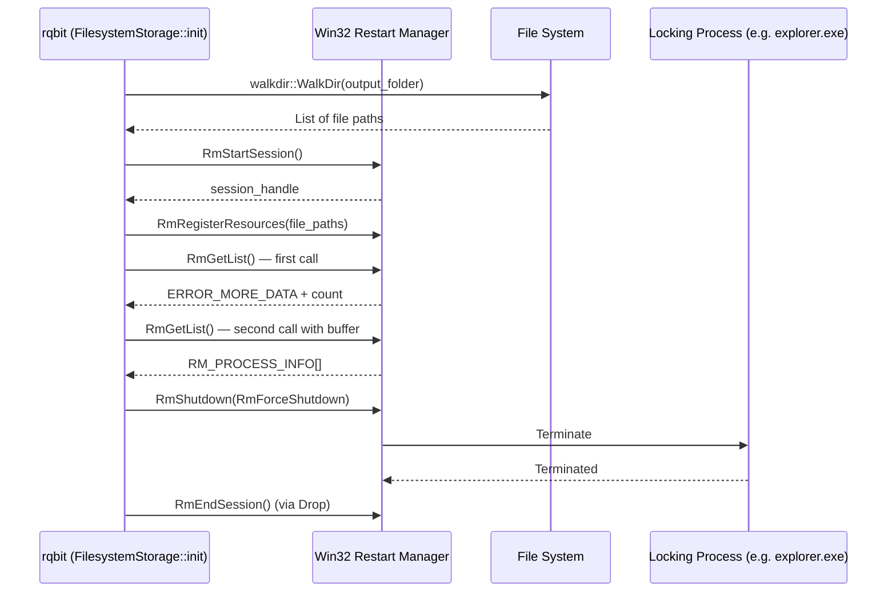
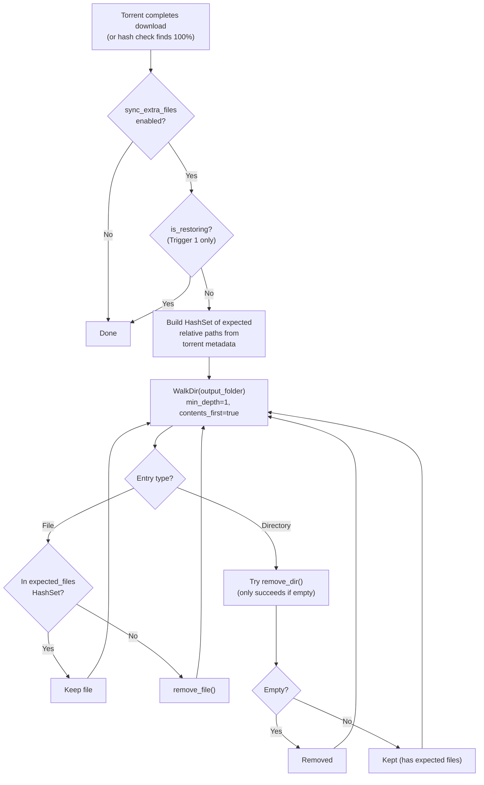

# rqbit Technical Documentation — Feature Deep Dive

## Table of Contents
- [1. Kill Locking Processes (Windows Only)](#1-kill-locking-processes-windows-only)
- [2. Sync Extra Files](#2-sync-extra-files)

---

## 1. Kill Locking Processes (Windows Only)

### Overview

On Windows, processes like File Explorer (`explorer.exe`) frequently hold open handles to files and directories, creating `ERROR_SHARING_VIOLATION` (OS error 32) when rqbit attempts to open torrent data files for writing. The **Kill Locking Processes** feature uses the Win32 **Restart Manager API** to detect and gracefully terminate any process that is locking files in the torrent's output directory before rqbit initializes storage.

### Configuration & Default State

| Layer | Default | Type |
|---|---|---|
| CLI (`rqbit` binary) | `false` | Hard-coded |
| Desktop App (Tauri) | `false` | User-configurable via UI |
| Per-torrent (`AddTorrentOptions`) | `None` (inherits from session) | `Option<bool>` |

**Desktop UI location:** Settings → Features → "Kill Locking Processes (Windows only)"

### Data Flow: Configuration → Execution

```
Desktop UI (configure.tsx)
  → features.kill_locking_processes: bool
  → RqbitDesktopConfigFeatures (config.rs)
  → SessionOptions (session.rs)
  → Session struct field (session.rs:154)
  → ManagedTorrentOptions (mod.rs:122)
  → FilesystemStorage::init() (fs.rs:274)
  → file_locking::kill_processes_locking_path()
```

**Per-torrent override resolution** (`session.rs:1353-1355`):

```rust
kill_locking_processes: opts
    .kill_locking_processes          // per-torrent Option<bool>
    .unwrap_or(self.kill_locking_processes),  // session default
```

### Core Implementation

**File:** `crates/librqbit/src/file_locking.rs` (139 lines)

The function uses the Win32 **Restart Manager** API sequence:

```
RmStartSession → RmRegisterResources → RmGetList → RmShutdown → RmEndSession
```

#### Full Source Code

```rust
// crates/librqbit/src/file_locking.rs

use std::path::Path;

#[cfg(windows)]
pub fn kill_processes_locking_path(path: &Path, recursive: bool) -> anyhow::Result<()> {
    use std::os::windows::ffi::OsStrExt;
    use windows::Win32::Foundation::{ERROR_MORE_DATA, WIN32_ERROR};
    use windows::Win32::System::RestartManager::{
        RM_PROCESS_INFO, RmEndSession, RmGetList, RmRegisterResources,
        RmShutdown, RmStartSession,
    };

    fn check_win32(err: WIN32_ERROR) -> windows::core::Result<()> {
        if err.is_ok() { Ok(()) } else { Err(windows::core::Error::from(err)) }
    }

    // Step 1: Collect all file paths (recursive walk if directory)
    let mut paths_to_check = Vec::new();
    if recursive && path.is_dir() {
        for entry in walkdir::WalkDir::new(path)
            .into_iter()
            .filter_map(|e| e.ok())
        {
            if !entry.file_type().is_dir() {
                paths_to_check.push(entry.path().to_owned());
            }
        }
    } else {
        paths_to_check.push(path.to_owned());
    }

    if paths_to_check.is_empty() {
        return Ok(());
    }

    // Step 2: Start a Restart Manager session
    let mut session_handle = 0;
    let mut session_key = [0u16; 32]; // CCH_RM_SESSION_KEY + 1

    unsafe {
        check_win32(RmStartSession(
            &mut session_handle,
            Some(0),
            windows::core::PWSTR(session_key.as_mut_ptr()),
        ))?;
    }

    // RAII guard to ensure RmEndSession is always called
    struct SessionGuard(u32);
    impl Drop for SessionGuard {
        fn drop(&mut self) {
            unsafe { let _ = RmEndSession(self.0); }
        }
    }
    let _guard = SessionGuard(session_handle);

    // Step 3: Convert paths to wide strings (UTF-16) for Win32 API
    let mut wide_paths = Vec::new();
    let mut pcwstrs = Vec::new();

    for p in &paths_to_check {
        let wide: Vec<u16> = p.as_os_str()
            .encode_wide()
            .chain(std::iter::once(0))
            .collect();
        wide_paths.push(wide);
    }
    for wide in &wide_paths {
        pcwstrs.push(windows::core::PCWSTR(wide.as_ptr()));
    }

    // Step 4: Register file resources with the Restart Manager
    unsafe {
        check_win32(RmRegisterResources(
            session_handle,
            Some(&pcwstrs),
            None, None,
        ))?;
    }

    // Step 5: Query for locking processes
    let mut reason = 0;
    let mut n_proc_info_needed = 0;
    let mut n_proc_info = 0;

    let res = unsafe {
        RmGetList(
            session_handle,
            &mut n_proc_info_needed,
            &mut n_proc_info,
            None,
            &mut reason,
        )
    };

    // Step 6: If processes found, get details and shut them down
    if res == ERROR_MORE_DATA {
        n_proc_info = n_proc_info_needed;
        let mut process_info = vec![RM_PROCESS_INFO::default(); n_proc_info as usize];

        unsafe {
            check_win32(RmGetList(
                session_handle,
                &mut n_proc_info_needed,
                &mut n_proc_info,
                Some(process_info.as_mut_ptr()),
                &mut reason,
            ))?;
        }

        if n_proc_info > 0 {
            tracing::warn!(
                "Found {} processes locking files in {:?}. Shutting them down...",
                n_proc_info, path
            );
            // RmShutdown with flag=1 (RmForceShutdown)
            unsafe {
                check_win32(RmShutdown(session_handle, 1, None))?;
            }
            tracing::info!("Processes terminated successfully.");
        }
    } else if res.is_ok() {
        tracing::debug!("No locking processes found for {:?}", path);
    } else {
        check_win32(res)?;
    }

    Ok(())
}

#[cfg(not(windows))]
pub fn kill_processes_locking_path(_path: &Path, _recursive: bool) -> anyhow::Result<()> {
    anyhow::bail!("kill_processes_locking_path is only supported on Windows")
}
```

### Trigger Point

**File:** `crates/librqbit/src/storage/filesystem/fs.rs` — inside `FilesystemStorage::init()`

```rust
fn init(
    &mut self,
    shared: &ManagedTorrentShared,
    metadata: &TorrentMetadata,
) -> anyhow::Result<()> {
    // ...
    if shared.options.kill_locking_processes && !shared.options.is_restoring {
        #[cfg(windows)]
        {
            if let Err(e) =
                crate::file_locking::kill_processes_locking_path(&self.output_folder, true)
            {
                warn!("Error killing locking processes: {:#}", e);
            }
        }
    }
    // ... proceed to create directories and open files
}
```

### Safety Guards

1. **`is_restoring` flag**: When the application restarts and restores torrents from session persistence, `is_restoring` is set to `true`, preventing the kill operation from running on every startup (`session.rs:317-320`).
2. **`#[cfg(windows)]`**: The kill logic is compile-time gated. On non-Windows platforms, the function returns an error bail.
3. **Error handling**: Failures are logged as warnings and **do not** prevent the torrent from proceeding — this is a best-effort operation.
4. **RAII `SessionGuard`**: Ensures `RmEndSession()` is always called even if the function fails midway, preventing Restart Manager session leaks.

### Win32 API Flow Diagram



### Key Dependencies

- **`windows` crate** — Win32 API bindings for `RestartManager` functions
- **`walkdir` crate** — Recursive directory traversal to find all files

---

## 2. Sync Extra Files

### Overview

The **Sync Extra Files** feature automatically removes any files and empty directories from a torrent's output folder that are **not** part of the torrent's metadata. This keeps the download directory clean by removing:
- Leftover files from previous incomplete downloads
- Files that were manually placed in the torrent directory
- Empty directories after file deletion

### Configuration & Default State

| Layer | Default | Type |
|---|---|---|
| CLI (`rqbit` binary) | `false` | Hard-coded |
| Desktop App (Tauri) | `false` | User-configurable via UI |
| Per-torrent (`AddTorrentOptions`) | `None` (inherits from session) | `Option<bool>` |

**Desktop UI location:** Settings → Features → "Sync Extra Files"

### Data Flow: Configuration → Execution

```
Desktop UI (configure.tsx)
  → features.sync_extra_files: bool
  → RqbitDesktopConfigFeatures (config.rs)
  → SessionOptions (session.rs)
  → Session struct field (session.rs:155)
  → ManagedTorrentOptions (mod.rs:123)
  → TorrentStateInitializing::finalize_check() (initializing.rs:295)
  → TorrentStateLive::on_piece_completed() (live/mod.rs:923)
  → sync_utils::remove_extra_files()
```

**Per-torrent override resolution** (`session.rs:1356`):

```rust
sync_extra_files: opts.sync_extra_files.unwrap_or(self.sync_extra_files),
```

### Two Trigger Points

The sync operation runs in **two distinct scenarios**:

#### Trigger 1: After Initial Hash Check (Already Complete Torrent)

**File:** `crates/librqbit/src/torrent_state/initializing.rs` — `finalize_check()`

When a torrent is added and its initial checksum validation finds that all pieces are already present (`hns.finished()` returns true), the sync runs **synchronously** during initialization:

```rust
// initializing.rs:293-304
// Sync extra files only for newly added torrents (not restored from session),
// when the torrent is already fully complete after hash check.
if self.shared.options.sync_extra_files && !self.shared.options.is_restoring && hns.finished() {
    use crate::sync_utils::remove_extra_files;
    info!("Syncing extra files...");
    if let Err(e) = remove_extra_files(
        &self.metadata.info.info(),
        &self.shared.options.output_folder,
    ) {
        warn!("Error removing extra files: {:#}", e);
    }
}
```

**Condition:** `sync_extra_files=true` AND `is_restoring=false` AND torrent is fully complete.

#### Trigger 2: When Download Finishes (Live Download)

**File:** `crates/librqbit/src/torrent_state/live/mod.rs` — `on_piece_completed()`

When the final piece of a torrent is downloaded and verified, the sync runs **asynchronously** in a `spawn_blocking` task:

```rust
// live/mod.rs:923-946
if self.shared.options.sync_extra_files {
    let info = self.metadata.clone();
    let shared = self.shared.clone();
    self.spawn(
        debug_span!(parent: shared.span.clone(), "sync_extra_files"),
        "sync_extra_files",
        async move {
            tokio::task::spawn_blocking(move || {
                use crate::sync_utils::remove_extra_files;
                info!("Starting auto-removal of extra files...");
                if let Err(e) =
                    remove_extra_files(&info.info.info(), &shared.options.output_folder)
                {
                    warn!("Error in auto-removal: {:#}", e);
                } else {
                    info!("Auto-removal complete.");
                }
            })
            .await
            .context("spawn_blocking failed")
            .map_err(|e| crate::Error::Anyhow(e))
        },
    );
}
```

**Key difference from Trigger 1:** No `is_restoring` check needed here — a restored torrent would not be going through `on_piece_completed()` unless it actually downloads a new piece.

### Core Implementation

**File:** `crates/librqbit/src/sync_utils.rs` (118 lines)

#### Full Source Code

```rust
// crates/librqbit/src/sync_utils.rs

use std::borrow::Cow;
use std::collections::HashSet;
use std::ffi::OsStr;
use std::path::{Path, PathBuf};

use librqbit_core::torrent_metainfo::TorrentMetaV1Info;
use tracing::{info, warn};

pub fn remove_extra_files(
    info: &TorrentMetaV1Info<buffers::ByteBufOwned>,
    root_path: &Path,
) -> anyhow::Result<()> {
    if !root_path.exists() {
        return Ok(());
    }

    // Step 1: Build a HashSet of expected relative file paths from torrent metadata
    let mut expected_files: HashSet<PathBuf> = HashSet::new();

    if let Some(files) = &info.files {
        // Multi-file torrent
        for file in files {
            let mut path = PathBuf::new();
            for component in &file.path {
                path.push(&*bytes_to_osstr(&component.0));
            }
            expected_files.insert(path);
        }
    } else if let Some(name) = &info.name {
        // Single-file torrent
        let name_str = String::from_utf8_lossy(&name.0);
        expected_files.insert(PathBuf::from(name_str.as_ref()));
    }

    // Step 2: Walk the directory (depth-first, children before parents)
    for entry in walkdir::WalkDir::new(root_path)
        .min_depth(1)               // skip the root directory itself
        .contents_first(true)       // visit children before parents (for empty dir cleanup)
        .into_iter()
        .filter_map(|e| e.ok())
    {
        let path = entry.path();
        if path == root_path {
            continue;
        }

        let relative = match path.strip_prefix(root_path) {
            Ok(p) => p,
            Err(_) => continue,
        };

        if entry.file_type().is_dir() {
            // Remove empty directories (non-recursive remove_dir, safe if not empty)
            if std::fs::remove_dir(path).is_ok() {
                info!("Removed empty directory: {:?}", relative);
            }
        } else {
            // Remove files not in the expected set
            if !expected_files.contains(relative) {
                info!("Removing extra file: {:?}", relative);
                if let Err(e) = std::fs::remove_file(path) {
                    warn!("Failed to remove file {:?}: {:?}", path, e);
                }
            }
        }
    }

    Ok(())
}

// Platform-specific byte-to-OsStr conversion
#[cfg(windows)]
fn bytes_to_osstr(b: &[u8]) -> std::borrow::Cow<'_, OsStr> {
    use std::ffi::OsString;
    let s = String::from_utf8_lossy(b).into_owned();
    Cow::Owned(OsString::from(s))
}

#[cfg(unix)]
fn bytes_to_osstr(b: &[u8]) -> std::borrow::Cow<'_, OsStr> {
    use std::os::unix::ffi::OsStrExt;
    std::borrow::Cow::Borrowed(OsStr::from_bytes(b))
}

#[cfg(not(any(unix, windows)))]
fn bytes_to_osstr(b: &[u8]) -> std::borrow::Cow<'_, OsStr> {
    use std::ffi::OsString;
    let s = String::from_utf8_lossy(b).into_owned();
    Cow::Owned(OsString::from(s))
}
```

### Safety Guards

1. **`is_restoring` flag (Trigger 1 only)**: Prevents sync from running on application restart when restoring persisted torrents. Without this guard, restoration could delete user files on every startup.
2. **`hns.finished()` check (Trigger 1 only)**: Only runs when the torrent is already 100% complete after hash check — does not interfere with partial downloads.
3. **`contents_first(true)` traversal**: `walkdir` visits children before parents, so empty directories are cleaned up correctly after their contents are removed.
4. **Non-recursive `remove_dir`**: `std::fs::remove_dir()` only deletes **empty** directories. If a directory still contains expected files, it will silently fail.
5. **Error tolerance**: Both file removal and directory removal failures are logged and do not abort the operation.

### Algorithm Flow Diagram



### Key Dependencies

- **`walkdir` crate** — Recursive directory traversal with depth-first ordering
- **`librqbit_core::torrent_metainfo::TorrentMetaV1Info`** — Torrent metadata containing the file list

---

## Shared Infrastructure

### The `is_restoring` Flag

Both features share a critical safety mechanism: the `is_restoring` boolean flag.

**Definition** (`session.rs:317-320`, `mod.rs:125-127`):
```rust
/// Set to true when restoring from session persistence.
/// Suppresses kill_locking_processes and sync_extra_files during init.
pub is_restoring: bool,
```

This flag is set to `true` only when the session persistence layer restores previously-known torrents at application startup. It prevents:
- **Kill Locking Processes** from terminating processes on every restart
- **Sync Extra Files** from deleting user-placed files during session restoration

### `ManagedTorrentOptions` Struct

**File:** `crates/librqbit/src/torrent_state/mod.rs:112-132`

```rust
#[derive(Default)]
pub(crate) struct ManagedTorrentOptions {
    pub force_tracker_interval: Option<Duration>,
    pub peer_connect_timeout: Option<Duration>,
    pub peer_read_write_timeout: Option<Duration>,
    pub allow_overwrite: bool,
    pub output_folder: PathBuf,
    pub ratelimits: LimitsConfig,
    pub initial_peers: Vec<SocketAddr>,
    pub peer_limit: Option<usize>,
    pub kill_locking_processes: bool,   // ← Feature flag
    pub sync_extra_files: bool,         // ← Feature flag
    pub is_restoring: bool,             // ← Safety guard
    pub _skip_hash_check: bool,
    pub permissive_file_opening: Option<bool>,
    #[cfg(feature = "disable-upload")]
    pub _disable_upload: bool,
}
```

### Desktop Config Structure

**File:** `desktop/src-tauri/src/config.rs:161-172`

```rust
#[derive(Clone, Default, Serialize, Deserialize, PartialEq, Eq, Debug)]
#[serde(default)]
pub struct RqbitDesktopConfigFeatures {
    #[serde(default)]
    pub kill_locking_processes: bool,

    #[serde(default)]
    pub sync_extra_files: bool,

    #[serde(default)]
    pub permissive_file_opening: bool,
}
```

Both features default to `false` via `#[serde(default)]` and `Default` derive, ensuring opt-in behavior.

### Frontend TypeScript Interface

**File:** `desktop/src/configuration.tsx:44-48`

```typescript
interface RqbitDesktopConfigFeatures {
  kill_locking_processes: boolean;
  sync_extra_files: boolean;
  permissive_file_opening: boolean;
}
```

### Desktop → Backend Wiring

**File:** `desktop/src-tauri/src/main.rs:134-135`

```rust
SessionOptions {
    // ...
    kill_locking_processes: config.features.kill_locking_processes,
    sync_extra_files: config.features.sync_extra_files,
    // ...
}
```

---

## File Index

| File | Feature | Role |
|---|---|---|
| `crates/librqbit/src/file_locking.rs` | Kill Locking | Core Win32 Restart Manager implementation |
| `crates/librqbit/src/sync_utils.rs` | Sync Extra | Core file cleanup algorithm |
| `crates/librqbit/src/storage/filesystem/fs.rs` | Kill Locking | Trigger point (storage init) |
| `crates/librqbit/src/torrent_state/initializing.rs` | Sync Extra | Trigger point 1 (post hash check) |
| `crates/librqbit/src/torrent_state/live/mod.rs` | Sync Extra | Trigger point 2 (download completion) |
| `crates/librqbit/src/torrent_state/mod.rs` | Both | Options struct definition |
| `crates/librqbit/src/session.rs` | Both | Session-level config & per-torrent propagation |
| `desktop/src-tauri/src/config.rs` | Both | Desktop config persistence struct |
| `desktop/src-tauri/src/main.rs` | Both | Desktop → Session wiring |
| `desktop/src/configuration.tsx` | Both | TypeScript interface definition |
| `desktop/src/configure.tsx` | Both | Settings UI checkboxes |
| `crates/rqbit/src/main.rs` | Both | CLI hardcodes both to `false` |
